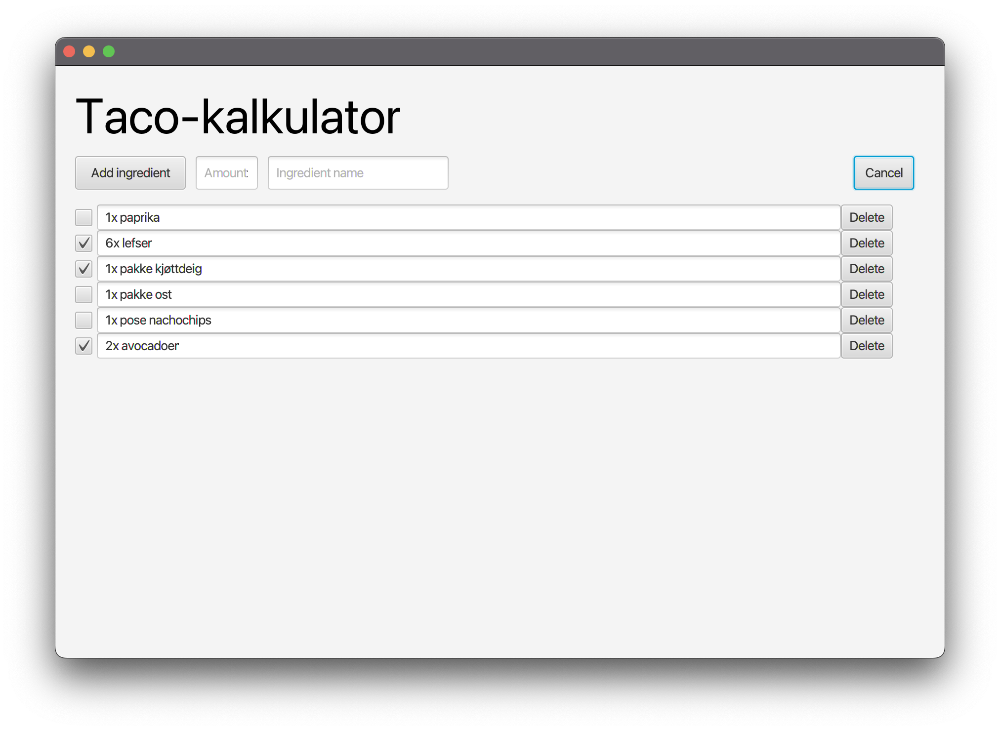
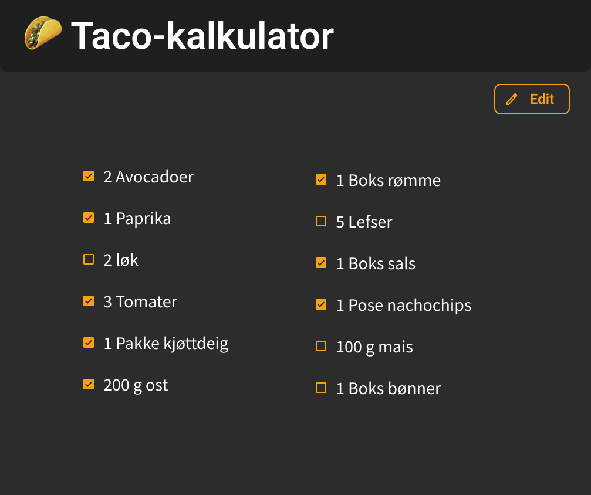
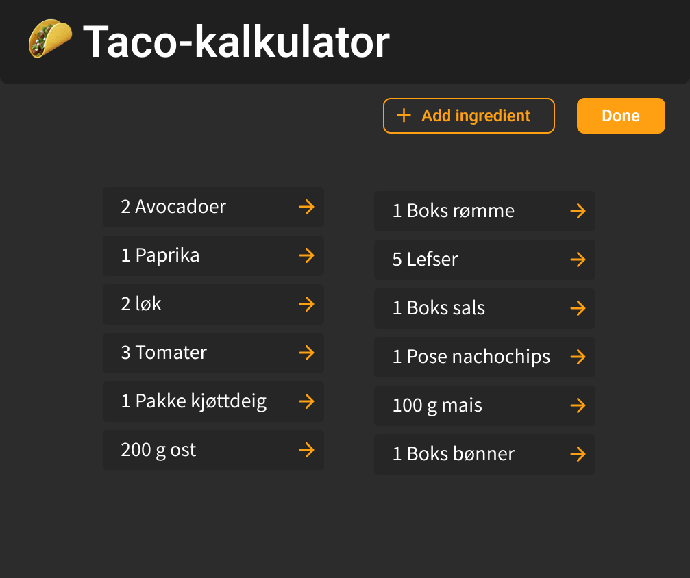

# Dokumentasjon

    <figure align="center">
        
        <figcaption><i>Skjermbilde fra applikasjonen.</i></figcaption>
    </figure>

**Denne versjonen fungerer som en veldig enkel handleliste, hvor man kan huke av de ingrediensene man har kjøpt. Denne iterasjonen tar utganspunktet i en [Figma-mockup](#mockup), men er veldig forenklet. I tillegg har vi laget [test-klasser](#tester) for både kjernelogikken og brukergrensesnittet.**

## Struktur
Applikasjonen har en modulær struktur med følgende moduler og klasser:
* `core`-modul med kjernelogikken og lagring av data
    * `Ingredient`-klasse
    * `ShoppingList`-klasse
    * `LogicTest`-klasse (Tester Ingredient- og ShoppingList-klassene)
* `FxUI`-modul med brukergrensesnittet i JavaFX
    * `App`-klasse
    * `AppController`-klasse
    * `TacoCalcControllerTest`-klasse (Tester brukergrensesnittet)
## Implementert
Følgende *features* er implementert i denne versjonen av applikasjonen:
* Enkel visning av alle ingrediensene med egne avmerkingsbokser for når de er kjøpt.
* Legge til nye ingredienser med navn og antall.
* Fjerne ingredienser ved å trykke på `Edit`-knappen, og så `delete`-knappen til den ingredienen som skal fjernes. 
* Lokal lagring av ingredienser og mengde. 

## Ikke implementert
Ved neste iterasjon har vi planer om å utvide funksjonaliteten til appen ytterlige. Dette er de foreløpige ideene vi ser for oss å implementere:
* Mulighet til å redigere skalering for hver ingrediens
* Lage nye taco-oppskrifter med spesifikke ingredienser. Disse ferdilagde oppskriftene vil det være mulig å lagre på en server.
* En database med de vanligste ingrediensene og en anbefalt mengde. 

## Tester
Vi har laget tester til appen som har som formål å oppdage eventuelle feil i applikasjonen. Testene er laget for å kjøre med maven, og vi bruker jacoco for å generere en testrapport. Guide for hvordan man kan skrive ut en test-rapport finner du [her](/tacocalc/README.md#kjøring-av-tester).

## Brukerhistorier
Til denne versjonen av applikasjonen så lagde vi to brukerhistorier som man kan finne [her](/docs/release%201/brukerhistorier.md).

## Mockup
Vi brukte Figma til å lage en *mockup* av hvordan vi så for oss at applikasjonen kunne se ut. Dette hjalp oss veldig mye, ettersom det ga gruppen en felles idé om retningen  vi skulle gå. Det første bildet fra mockupen viser den vanlige menyen, men bilde 2 viser hva som skjer hvis du trykker på "Edit"-knappen. 

Som man kan se så er *release 1* ikke helt lik mockupen vi lagde, men mockupen skal være en veiledning for videre utvikling.

    <figure align="center">
        
        <figcaption><i>Hovedside til taco-kalkulatoren</i></figcaption>
    </figure>

    <figure align="center">
        
        <figcaption><i>Side når man har trykket på "Edit"-knappen</i></figcaption>
    </figure>

