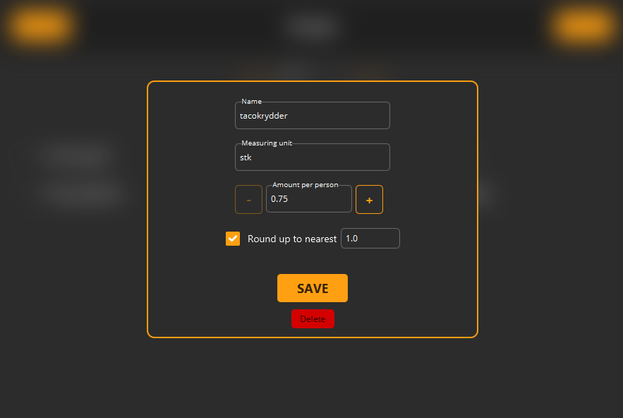
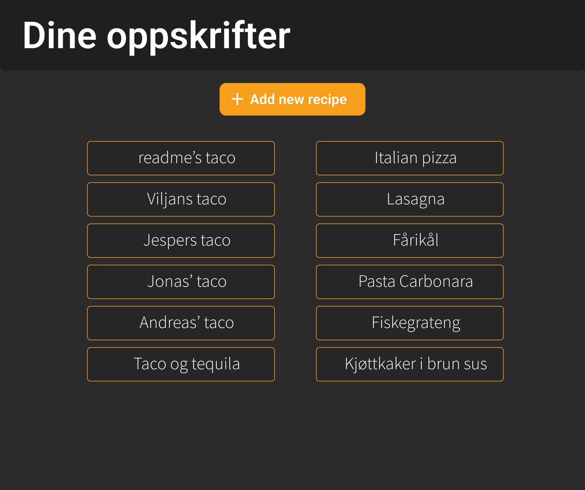

# Dokumentasjon

    <figure align="center">
        
        <figcaption><i>Skjermbilde fra applikasjonen.</i></figcaption>
    </figure>

**I den siste iterasjonen har vi valgt å fortsette med JavaFX, og dermed utvidet funksjonaliteten. Vi har fokusert på å ferdigstille målene vi satte fra starten av, med fokus på skalering og lagring. Denne iterasjonen har implementert en REST API, som en klient kan bruke til å sende forespørsler både lokalt og remote. Vi har brukt denne funksjonaliteten til å legge til standard oppskrifter en bruker kan hente, med mulighet for å utvide. I tillegg kan man nå installere en egen `executable`, som du finner en fremgangsmåte [her](../../recipecalc/README.md).**

## Struktur

Appen består av fem moduler, der hver samhandler med hverandre i henhold til pakkediagrammet under. Vi har også laget et klassediagram som beskriver hvordan noen av de viktigste klassene samhandler. Det er også et sekvensdiagram som eksemplifiserer en del av appen.

 

    <figure align="center">
        
        <figcaption><i>Pakke-diagrammet viser en oversikt over hvordan modulene og pakkene i applikasjonen henger sammen.</i></figcaption>
    </figure>

 

    <figure align="center">
        
        <figcaption><i>Klassediagram som viser de to viktigste core klassene og deres dependencies.</i></figcaption>
    </figure>

 

    <figure align="center">
        
        <figcaption><i>Sekvensdiagram som beskriver en vanlig forespørsel fra en bruker.</i></figcaption>
    </figure>

Beskrivelsen av strukturen finner du i hver av modulenes individuelle `README.md`-filer. Disse finner du her:

- [client](../../recipecalc/client/README.md)
- [core](../../recipecalc/core/README.md)
- [data](../../recipecalc/data/README.md)
- [fxui](../../recipecalc/fxui/README.md)
- [restapi](../../recipecalc/restapi/README.md)

_README.md filen i `restapi`-modulen beskriver detaljert funksjonaliteten til REST API-et._

## Implementert

Følgende _features_ er implementert i denne versjonen av applikasjonen:

- Henting og opplasting av oppskrifter til en database via et REST API
- Nye klasser for å samhandle med klient
- Ny stil på UI
- Skalering av hele oppskrifter
- Mulighet til å både sette og endre avrunding av individuelle ingredienser

    <figure align="center">
        
        <figcaption><i>Bilde 1: Start-meny hvor man har oversikt over alle oppskrifter.</i></figcaption>
    </figure>

 

    <figure align="center">
        
        <figcaption><i>Bilde 2: Menyen som kommer opp når man trykker "Create Recipe". Her lager man en ny oppskrift som lagres, og man kan deretter gå inn og legge inn nye ingredienser.</i></figcaption>
    </figure>

    <figure align="center">
        
        
        <figcaption><i>Bilde 3: Eksempeloppskriften "Amogus" før og etter skalering.</i></figcaption>
    </figure>

    <figure align="center">
        
        <figcaption><i>Bilde 4: Dette er menyen man får opp når man trykker på "Edit" knappen. Her kan man skrive inn i feltene og trykke "Add Ingredient" for å legge til en ny ingrediens, eller redigere eksisterende (Se Bilde 5).</i></figcaption>
    </figure>

    <figure align="center">
        
        <figcaption><i>Bilde 5: Når man trykker pila til den valgte ingrediensen er dette menyen man får opp.</i></figcaption>
    </figure>

## Arbeidsflyt

I likhet med tidligere iterasjoner har vi lagd lokale grener som vi har delt opp i `feature/`, `bug/` og `fix/`. Nytt under denne iterasjonen er at vi i større grad har fokusert på mer omfattende commit-meldinger, mer beskrivende merge-requests og det å bruke kommentarer på disse. Dette førte for eksempel til at vi oppdaget feil i en merge request, da en annen reviewer fant en feil som den første revieweren ikke gjorde.

Vi har fortsatt vår relativt løse arbeidsstruktur, med god bruk av LiveShare. `master`-branchen er som alltid _off limits_, og vi har hele tiden hatt som mål at `master` alltid skal kunne kjøre, noe implementasjonen av `CI pipelines` har sørget for at skjer. Vi begynte også å sette som regel at issues ikke skulle være noe mer generelle enn at en arbeider kunne åpne den og med en gang skjønne hvor i prosjektet problemet eksisterte. Slik ble samarbeidet forbedret, da hvem som helst kunne åpne en issue uten at en annen måtte spørre hva det var snakk om. Det ble også lettere for alle å følge med på hva som ble gjort av hvem når utenfor møtetider.

Når det gjelder møter har vi i større grad hatt digitale møter, med stor suksess, da dette senket terskelen for å ha møter betraktelig. Vi kunne dermed møtes oftere på flere "upassende" tidspunkt, da alle på gruppa har hatt veldig travle hverdager. Eksempelvis klarte vi å presse inn et møte selvom et medlem hadde vært på noe før møtetidspunktet, grunnet at personen skulle hjemom. Med fysisk oppmøte hadde dette vært umulig, men møtet viste seg å være både viktig og produktivt.

## Tester

Vi har laget tester til appen som har som formål å oppdage eventuelle feil i applikasjonen. Testene er laget for å kjøre med maven, og vi bruker jacoco for å generere en testrapport. Guide for hvordan man kan skrive ut en test-rapport finner du [her](/recipecalc/README.md#kjøring-av-tester). Nytt i denne iterasjonen er at vi har hatt fokus på å splitte testene for å mer oversiktlig teste individuelle klasser, istedenfor hele moduler. Unntaket er modulen `restapi`, som kun har en testklasse da den krever såkalt _mocking_ av serveren.

## Brukerhistorier

Vi valgte å skrive to nye historier til to brukere vi allerede har møtt i [release1](../release1/brukerhistorier.md) og [release2](../release2/brukerhistorier.md). De nye historiene finner du [her](brukerhistorier.md).

## Figma mockups

    <figure align="center">
        
    </figure>

    <figure align="center">
        
    </figure>

    <figure align="center">
        
    </figure>

    <figure align="center">
        
    </figure>

    <figure align="center">
        
    </figure>

