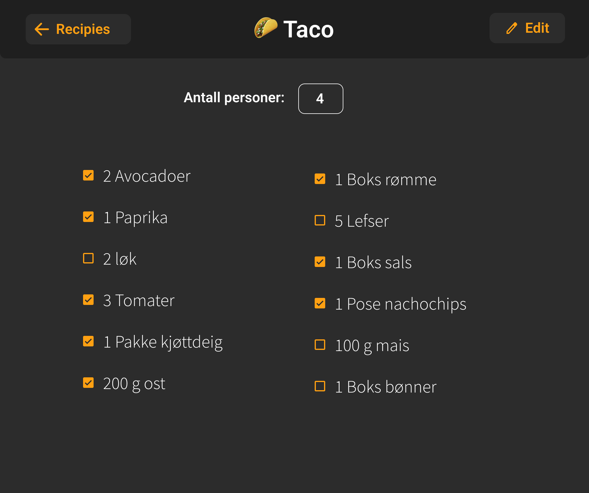

# Beskrivelse av applikasjon

    <figure align="center">
        
        <figcaption><i>Mockup av hvordan vi ser for oss at applikasjonen skal bli</i></figcaption>
    </figure>

Applikasjonen er en redigerbar oppskrifts-kalkulator. Når man åpner appen kan man velge en oppskrift, som du kan gå inn og velge antall personer som skal spise. Da vil du få oppgitt riktig mengde av hver ingrediens som trengs i oppskriften. Samtidig fungerer applikasjonen som en handleliste, hvor man kan huke av ingrediensene etterhvert som man kjøper de. Det skal være veldig lett å redigere skaleringen av ingrediensene i applikasjonen, hvis man for eksempel fant ut av at man fikk alt for mye kjøttdeig en gitt gang. Det er også mulig å legge til nye ingredienser og fjerne ingredienser. Det er også mulig å lage nye oppskrifter, samt slette og redigere gamle. Applikasjonen implementerer også lokal persistens via lokal database, og en kan derfor lagre og hente oppskrifter fra denne.

## Oppbygging av prosjektet

Prosjektet består av fem moduler:

- [`Core`](/recipecalc/core/README.md): grunnleggende logikk
- [`Client`](/recipecalc/client/README.md): sender forespørsler til REST API-et
- [`Data`](/recipecalc/data/README.md): håndtering av lokal persistens
- [`FxUI`](/recipecalc/fxui/README.md): JavaFX brukergrensesnitt
- [`REST API`](/recipecalc/restapi/README.md): REST API for lagring og lesing av data til lokal server

## Kjøring av kode

For at man skal kunne installere og kjøre koden må man ha en server gående. Derfor må man først sette i gang en server. Dette gjelder også når man skal kjøre en executable av applikasjonen.

### Kjøring av server

1. Bytt mappe til `recipecalc/restapi`
2. Kjør `mvn clean install`
3. Kjør `mvn spring-boot:run`

For at serveren skal fortsette å kjøre kan du ikke lukke (eller bruke) den terminalen du startet den i. For å avslutte serveren kan du bruke Ctrl + C.

### Kjøring av JavaFX-GUI

1. Bytt mappe til `recipecalc`
2. Kjør `mvn clean install`
3. Bytt mappe til `fxui`
4. Kjør `mvn javafx:run` i recipecalc

Man kan eventuelt kjøre bash-scriptet `installSkipTests.sh` i steg 2. Dette kan du gjøre ved å bruke denne kommandoen i terminalen `./installSkipTests.sh`. Dette hopper over tester, og vil dermed spare litt tid.

## Lage en .exe (executable) for Windows

1. Installer [.NET Framework 3.5](https://www.microsoft.com/en-in/download/confirmation.aspx?id=22)
2. Installer [Wix 3.11](https://github.com/wixtoolset/wix3/releases)
3. Kjør `mvn javafx:jlink -f ./fxui/pom.xml` i /recipecalc
4. Kjør `mvn jpackage:jpackage -f ./fxui/pom.xml` i /recipecalc
5. Gå inn i `/recipecalc/fxui/target/dist/`. Her finner du en .exe fil.
6. Kjør denne, og følg oppsettet. Du skal nå ha en app ved navn `RecipeCalc.exe`

## Lage en .dmg for mac

1. Kjør `mvn javafx:jlink -f ./fxui/pom.xml` i /recipecalc
2. Kjør `mvn jpackage:jpackage -f ./fxui/pom.xml` i /recipecalc
3. Gå inn i mappen `/recipecalc/fxui/target/dist/`. Her finner du en `Recipe Calculator-1.0.0.dmg` fil.
4. Kjør denne, og følg oppsettet.
5. NB! Første gang man åpner applikasjonen så ma man holde inne `control` og klikke på applikasjonen, så velge *open* fra menyen som kommer opp.

## Tester

Når du kjører `mvn clean install` vil JaCoCo lage testrapporter. Hver modul har hver sin rapport som ligger i target-mappen i modulen. For å se rapportene for testdekningsgrad, åpne HTML filene.

- [`recipecalc/core/target/site/jacoco/index.html`](/recipecalc/core/target/site/jacoco/)
- [`recipecalc/data/target/site/jacoco/index.html`](/recipecalc/data/target/site/jacoco/)
- [`recipecalc/fxui/target/site/jacoco/index.html`](/recipecalc/fxui/target/site/jacoco/)
- [`recipecalc/restapi/target/site/jacoco/index.html`](/recipecalc/restapi/target/site/jacoco/)

## Dokumentasjon og brukerhistorier

Her finner du dokumentasjon og brukerhistoriene til applikasjonen:

### Release 1

- [Dokumentasjon](/docs/release1/dokumentasjon.md)
- [Brukerhistorier](/docs/release1/brukerhistorier.md)

### Release 2

- [Dokumentasjon](/docs/release2/dokumentasjon.md)
- [Brukerhistorier](/docs/release2/brukerhistorier.md)

### Release 3

- [Dokumentasjon](/docs/release3/dokumentasjon.md)
- [Brukerhistorier](/docs/release3/brukerhistorier.md)
